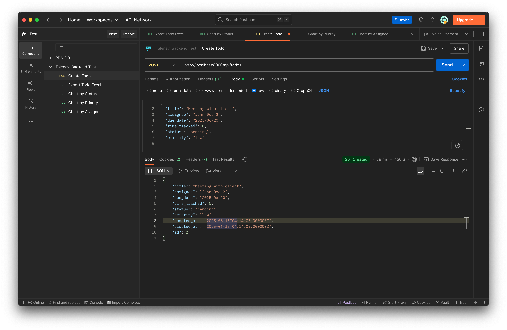
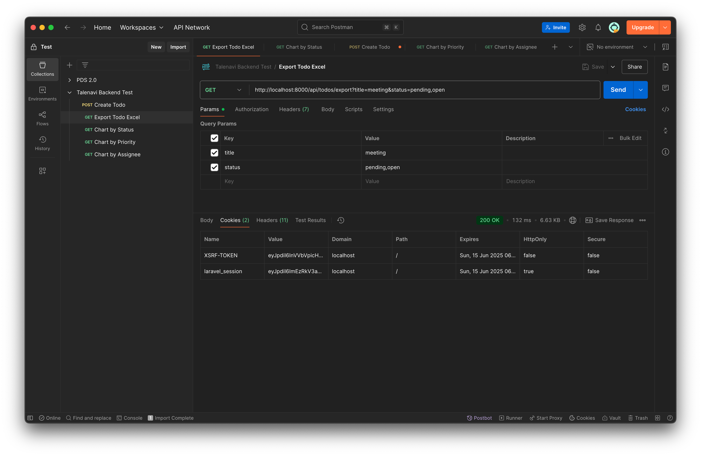
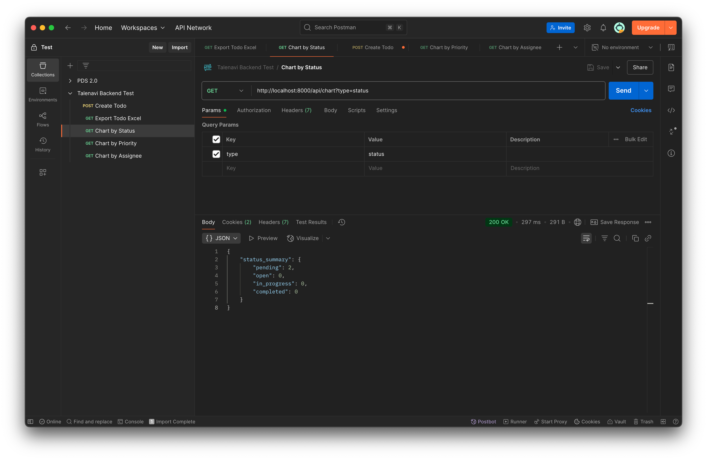
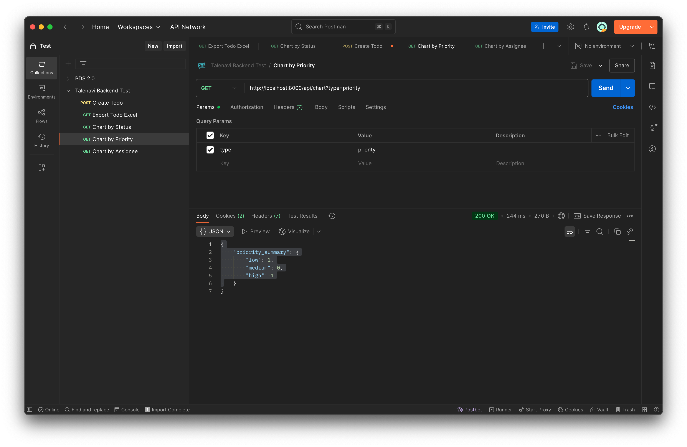
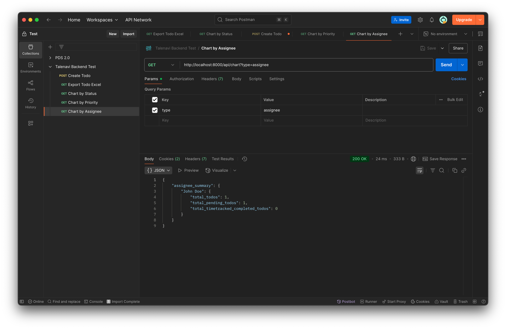

## Talenavi Laravel Backend Test

### Requirement

-   PHP >= 8.1
-   Laravel 10+
-   MySQL/PostgreSQL

### Setup

1. `composer install`
2. `cp .env.example .env`
3. `php artisan key:generate`
4. `Konfigurasi DB di .env`
5. `php artisan migrate`
6. `php artisan serve`

### API

-   `POST /api/todos` – create todo
-   `GET /api/todos/export` – download Excel
-   `GET /api/chart?type=status|priority|assignee`

### Postman Collection

Untuk mempermudah pengujian API, gunakan file koleksi Postman berikut:
Talenavi_Postman_Collection.json
Silakan import file ini ke dalam Postman.

### Result Test API

-   
-   
-   
-   
-   
